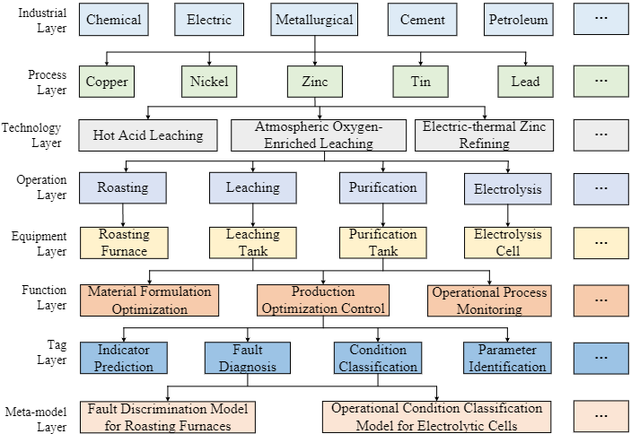

# IndustryDictionary
<div align="center">

<h1> Hierarchical Classification Domain Dictionary Construction for Process Industry Based on Knowledge Graph </h1>

<div>
    <p> <b>South China University of Technology & Pengcheng Laboratory</b> </p>
</div>


</div>

# Introduction

This project focuses on constructing a hierarchical classification domain dictionary for the process industry, leveraging knowledge graphs. The process industry, encompassing metallurgy, petroleum, chemicals, building materials, and electricity, is essential for economic and societal development but faces challenges such as insufficient automation and skilled labor shortages. Our method includes efficient entity recognition and relationship extraction, effective updating and expansion of industrial entities, and systematic mapping of entity categories to build a comprehensive dictionary. This provides robust technical support for industrial knowledge management and intelligent manufacturing.

## Features
- **Hierarchical Classification**: Organizes domain-specific terms and concepts in a hierarchical structure for efficient data management and retrieval.
- **Knowledge Graph Integration**: Utilizes knowledge graphs to interlink related concepts and provide context-aware information retrieval.
- **Scalability**: Designed to handle large-scale industrial data with the ability to scale as needed.
- **Flexibility**: Easily adaptable to different domains within the process industry.



## Installation

To install and set up this project, follow these steps:

1. **Clone the Repository**
    ```bash
    git clone https://github.com/ecjtulrh/IndustryDictionary/.git
    cd code
    ```

2. **Install Dependencies**
    ```bash
    pip install -r requirements.txt
    ```

3. **Setup Neo4j Database**
    - Download and install Neo4j from [Neo4j Download Center](https://neo4j.com/download/)
    - Start the Neo4j database and set up a new project
    - Import the provided data into Neo4j

4. **Configure Settings**
    - Update the `config.json` file with your Neo4j database credentials and other configuration settings

## Usage

1. **Run the Entity Recognition and Relationship Extraction**
    ```bash
    python entity_recognition.py
    ```

2. **Update and Expand Entities**
    ```bash
    python update_entities.py
    ```

3. **Build the Hierarchical Classification Dictionary**
    ```bash
    python build_dictionary.py
    ```

## Experimental Results

For detailed experimental results, comparisons with baseline models, and error analysis, refer to the [paper](link-to-paper).

## Contributions

We welcome contributions to enhance this project. Please follow these steps:

1. Fork the repository
2. Create a new branch (`git checkout -b feature-branch`)
3. Commit your changes (`git commit -am 'Add new feature'`)
4. Push to the branch (`git push origin feature-branch`)
5. Create a new Pull Request

## License

This project is licensed under the MIT License. See the [LICENSE](LICENSE) file for more details.

## Acknowledgements

We thank all the contributors and the community for their valuable input and support.

<h2 id="1"> Quick Start</h2>

<h3 id="1-1">Environment Configuration</h3>

*KGDD* supports both **manual** and **docker image** environment configuration, you can choose the appropriate way to build.
#### 🔧Manual Environment Configuration
```shell

conda create -n kgdd python=3.8 -y

conda activate kgdd
pip install torch==1.13.1+cu116 --extra-index-url https://download.pytorch.org/whl/cu116

pip install -r requirements.txt
```
#### 🐳Building With Docker Images
```shell
Coming soon
```


## Citation

If you use the codes and datasets , please cite the following paper(not published yet).

```

```
